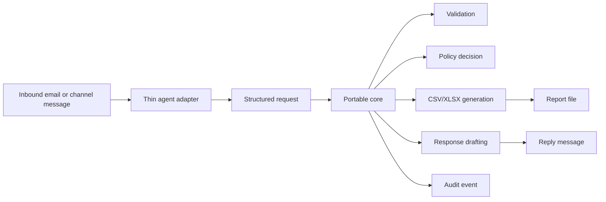

# Portable Email-to-Report Agent

This is a portfolio project for a deployable business-agent pattern:

1. Document the messy human workflow before agentifying it.
2. Define a black-box contract for inputs, outputs, policy, and audit.
3. Build portable business logic that does not depend on one agent vendor.
4. Add thin agent/runtime adapters around that stable core.
5. Evaluate behavior against fixtures instead of trusting a prompt demo.

The example workflow is a sales-data request process. A requester sends an unstructured email asking for a report. The system interprets the request, asks for clarification where needed, checks permissions, generates a deterministic CSV/XLSX report from synthetic data, drafts a response, and records an audit event.

## What This Demonstrates

- Business-process understanding before implementation.
- A bounded agent that could sit behind email, Teams, Copilot, OpenAI, a web form, or another surface.
- Deterministic policy checks, report generation, response drafting, and audit logging.
- Vendor-neutral core logic with OpenAI Agents SDK as one working adapter.
- OpenAI-compatible provider support through Together AI, while treating model choice as an evaluated operational decision.
- Microsoft Copilot/Agents mapping without committing to Microsoft implementation earlier than necessary.

This is not a general BI replacement. It is a narrow, governed request-handling workflow.

## Five-Minute Tour

Start here:

- [Process overview](docs/process-overview.md): what the manual workflow is and where an agent helps.
- [Black-box contract](docs/black-box-contract.md): stable input/output and audit expectations.
- [Architecture](docs/architecture.md): diagrams for the portable core, adapter boundary, and before/after workflow.
- [Evaluation results](docs/evaluation-results.md): deterministic baseline and live-adapter observations.
- [Microsoft Copilot mapping](docs/microsoft-copilot-mapping.md): how the same core would surface in Microsoft 365 without platform lock-in.
- [Demo script](docs/demo-script.md): suggested walkthrough for an interview or screen recording.

Then inspect the implementation:

- [agent_core](agent_core): vendor-neutral schemas, policy, reports, response drafting, audit, evaluation.
- [implementations/openai_agents_sdk](implementations/openai_agents_sdk): thin OpenAI Agents SDK adapter.
- [samples](samples): synthetic inbound requests, policy/data fixtures, expected outputs, and committed example artifacts.
- [tests](tests): deterministic tests plus adapter and evaluation checks.

## Architecture



The model interprets language. The portable core decides, calculates, writes files, drafts governed responses, and audits.

## Quickstart

```powershell
python -m venv .venv
python -m pip install -r requirements.txt
python -m unittest discover -s tests
```

Run one fixture through the portable core:

```powershell
python tools\run_core_case.py case-001
```

Run the deterministic evaluation baseline:

```powershell
python tools\evaluate_cases.py --implementation core
```

Expected summary:

```text
Summary: 8 passed, 0 failed, 8 total, pass_rate=1.0
```

## Live Agent Adapter

Install the OpenAI Agents SDK:

```powershell
python -m pip install -r requirements-openai.txt
```

Run one case with the default OpenAI provider:

```powershell
$env:OPENAI_API_KEY = "sk-..."
python tools\run_openai_agent_case.py case-001
```

Run through Together AI's OpenAI-compatible endpoint:

```powershell
$env:OPENAI_AGENT_PROVIDER = "together"
$env:TOGETHER_API_KEY = "your-together-key"
$env:OPENAI_AGENT_MODEL = "openai/gpt-oss-20b"
python tools\run_openai_agent_case.py case-001
```

Compare model behavior for one run:

```powershell
python tools\run_openai_agent_case.py case-001 --model "provider/model-name"
```

Evaluate the live adapter against fixtures:

```powershell
python tools\evaluate_cases.py --implementation openai --cases case-002 case-003 case-008
```

## Example Artifacts

Committed example outputs are under [samples/example-outputs](samples/example-outputs):

- `reports/case-001.xlsx`: approved XLSX report.
- `reports/case-008.csv`: approved CSV trend report.
- `traces/case-001.json`: generated-report audit example.
- `traces/case-002.json`: clarification-required audit example.
- `traces/case-005.json`: approval-required audit example.

The regular [generated](generated) folder is ignored by Git for local runs.

## Design Boundaries

- The agent must call the portable core for every request.
- The agent may extract intent, but must not calculate metrics or decide policy.
- Clarification terminates the current processing run. A clarified reply starts a new run linked by request metadata.
- Model choice is evaluated by pass rate and reliability, not preference or token price alone.
- Microsoft is treated as a deployment surface until a real tenant-backed implementation is justified.

## Repository Layout

```text
docs/                         Workflow docs, architecture notes, demo material
samples/                      Synthetic data, requests, expected outputs, examples
agent_core/                   Vendor-neutral schemas, policy, reports, audit, evaluation
implementations/              Runtime-specific adapters
tools/                        CLI runners and evaluation commands
tests/                        Unit, adapter, and evaluation tests
generated/                    Local generated output, ignored by Git
```

## Key Documents

- [Backlog](docs/backlog.md)
- [Architecture](docs/architecture.md)
- [Demo script](docs/demo-script.md)
- [Implementation notes](docs/implementation-notes.md)
- [Limitations and extensions](docs/limitations-and-extensions.md)
- [Process overview](docs/process-overview.md)
- [Current human workflow](docs/current-human-workflow.md)
- [Black-box contract](docs/black-box-contract.md)
- [Supported request types](docs/supported-request-types.md)
- [Policy and permissions](docs/policy-and-permissions.md)
- [Clarification rules](docs/clarification-rules.md)
- [Evaluation plan](docs/evaluation-plan.md)
- [Evaluation results](docs/evaluation-results.md)
- [Synthetic business domain](docs/synthetic-business-domain.md)
- [Portable core](docs/portable-core.md)
- [OpenAI Agents SDK adapter](docs/openai-agents-sdk.md)
- [Microsoft Copilot mapping](docs/microsoft-copilot-mapping.md)
- [OpenAI agent transcript example](docs/openai-agent-transcript-example.md)
- [Plan review](docs/plan-review.md)
- [Source chat PDF](docs/agent-demo.pdf)
