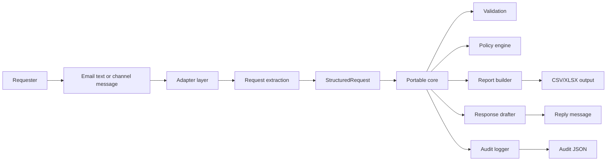
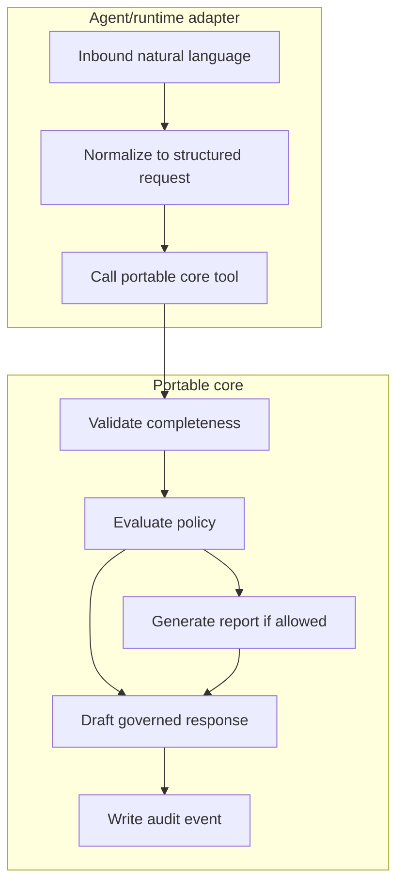
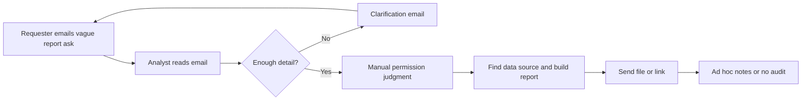
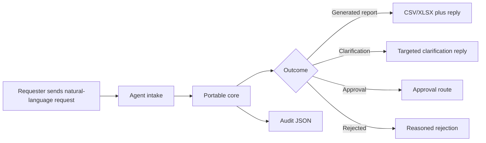
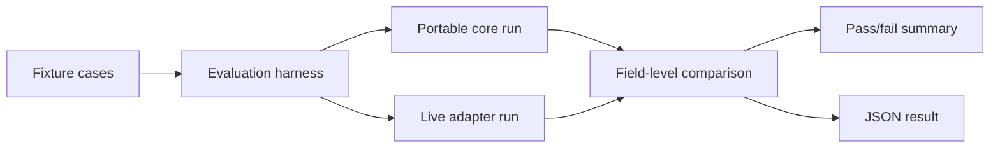

# Architecture

## Design Thesis

The project separates the thing that should be portable from the things that are naturally platform-specific.

Portable:

- request contract
- validation rules
- entitlement policy
- report planning and generation
- response outcome taxonomy
- audit schema
- evaluation fixtures

Platform-specific:

- email, Teams, Copilot, or web-channel handling
- provider/model configuration
- identity lookup
- file storage and delivery
- tracing and telemetry integrations
- publishing and tenant governance

## Runtime Architecture

The adapter can be OpenAI Agents SDK, Microsoft 365 Agents SDK, Copilot Studio calling a custom API, a web form, or a plain CLI runner. The core behavior stays the same.

## Agent Boundary

The agent may interpret language and choose structured fields. It must not:

- invent sales data
- calculate metrics
- make entitlement decisions
- skip policy checks
- generate report files directly
- hide clarification or approval requirements

## Before Workflow

The manual process works, but it depends on analyst memory, inconsistent policy interpretation, and repeated navigation across corporate UI surfaces.

## After Workflow

The improved workflow keeps the natural-language entry point while making policy, output, and audit deterministic.

## Evaluation Architecture

The harness compares outcomes, structured request fields, policy decisions, report plans, output files, and audit events. For live model runs, it also records provider and model metadata.

## Main Code Paths

| Path | Role |
| --- | --- |
| `agent_core/models.py` | Portable data contracts. |
| `agent_core/workflow.py` | Main deterministic process orchestration. |
| `agent_core/policies/engine.py` | Permission and approval decisions. |
| `agent_core/report_generation/` | CSV/XLSX planning and output. |
| `agent_core/evaluation.py` | Fixture scoring and summary logic. |
| `implementations/openai_agents_sdk/` | Thin live agent adapter. |
| `tools/evaluate_cases.py` | Repeatable evaluation CLI. |
