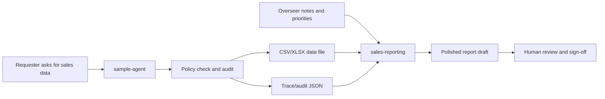

# Companion Project Scenario

## Purpose

This project pairs naturally with [sales-reporting](https://github.com/nikcholer/sales-reporting), a sibling portfolio project that demonstrates a different corporate AI pattern.

The useful story is not that the two repos form one production system. It is that they show two adjacent points in a governed reporting workflow:

- `sample-agent` turns messy report requests into controlled data files, response text, and audit events.
- `sales-reporting` lets a human overseer combine validated data, local notes, business priorities, and external context into a polished management report.

Together, they show a realistic human-in-the-loop arc: AI can automate bounded data handling, but a human can still add judgment, narrative intent, and corporate context before final synthesis.

## Scenario

Example flow:

1. A requester asks for a governed sales report.
2. `sample-agent` extracts the request, checks permissions, generates the allowed CSV/XLSX, drafts a response, and writes an audit event.
3. A manager or analyst reviews the generated file and adds notes such as:
   - which corporate priority matters this quarter
   - which caveats should be handled carefully
   - what the audience already knows
   - what decisions the report should support
4. `sales-reporting` combines validated local data, human notes, and configured AI/context tools into a polished report draft.
5. A human reviews the final narrative before it is shared.

## Why This Matters

This pairing avoids two common extremes:

- fully manual reporting, where analysts repeatedly perform low-value data handling
- fully automated narrative generation, where the model is expected to infer corporate priorities it cannot know

The boundary is more credible:

- deterministic systems handle permissioned data preparation
- AI helps structure and synthesize
- humans provide intent, judgment, and accountability

## Not A Hard Dependency

The repos should remain independent.

`sample-agent` does not need to import or call `sales-reporting`, and `sales-reporting` does not need to depend on `sample-agent` outputs. The cross-reference is a portfolio scenario showing how two patterns can fit together:

- governed agentic intake and report-file generation
- human-in-the-loop report synthesis and presentation

That keeps each project inspectable on its own while making the broader corporate AI story more obvious.
