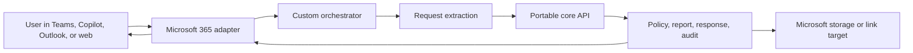

# Microsoft Copilot Mapping

## Purpose

This document maps the portable email-to-report workflow to Microsoft 365 Copilot and Copilot Studio concepts. It is intentionally architectural: the project should show that the business capability could be surfaced in Microsoft channels without moving the core policy, reporting, and audit logic into Microsoft-specific configuration.

## Current Recommendation

For v1, keep this as a documented Microsoft architecture rather than building a Microsoft 365 adapter.

Reasons:

- The portfolio already proves the important implementation boundary: natural-language intake is thin, while deterministic business logic lives in the portable core.
- A real Microsoft build would need tenant setup, Entra app registration, publishing policy, channel configuration, and possibly Teams/Copilot admin approval. Those are valuable deployment details, but they are not the core portfolio claim.
- A no-tenant scaffold would risk looking like ceremonial scaffolding. The stronger story is to show exactly where the Microsoft adapter would sit and what would change.
- Microsoft remains a strong deployment target because the workflow starts from email, approvals, Teams/Copilot surfaces, and enterprise identity.

## Microsoft Concept Map

| Portable project concept | Copilot Studio mapping | Microsoft 365 Agents SDK / custom engine mapping |
| --- | --- | --- |
| Inbound email text fixture | Topic trigger, Teams/Copilot message, or email channel message | Activity/message handled by custom engine adapter |
| Intake instructions | Agent instructions, topic descriptions, trigger phrases, generative orchestration guidance | System/developer instructions inside the custom orchestrator |
| Structured request schema | Topic variables or tool input schema | Adapter DTO passed to portable core |
| Clarification request | Question node or message response in same channel | Adapter returns clarification message and correlation metadata |
| Portable core | Custom connector/API, Power Automate flow, or custom hosted service | Custom hosted service called directly by the agent |
| Policy engine | Usually outside Copilot Studio, called through a tool/API | Remains in portable Python service or shared API |
| Report generation | Custom API or Power Automate action, with file stored in SharePoint/OneDrive | Portable service generates file, adapter stores or links it in Microsoft 365 |
| Audit event | Dataverse table, SharePoint list, Log Analytics, or custom API persistence | Portable audit event plus optional Microsoft telemetry sink |
| Approval-required outcome | Power Automate approval or business approval workflow | Adapter triggers approval system and returns pending status |
| Evaluation harness | External test suite, optionally run before publishing | Same harness run against custom engine adapter |

## Copilot Studio Path

Copilot Studio would be the fastest Microsoft-facing demo if the goal were to show a business-owned agent surface.

Likely shape:

1. Create a "Sales report request" agent.
2. Add a topic or generative orchestration description for report requests.
3. Capture fields such as requester, metric, geography, date range, dimensions, and output format as variables.
4. Use a tool node to call a custom API or Power Automate flow that wraps the portable core.
5. Return one of four user-facing outcomes: generated report, clarification required, approval required, or rejected.
6. Publish to Teams and Microsoft 365 Copilot only after internal testing.

This path is useful for demonstrating channel reach, governance, and business maintainability. It is less useful for proving portable orchestration, because Copilot Studio owns more of the conversation and publishing surface.

## Microsoft 365 Agents SDK / Custom Engine Path

The Microsoft 365 Agents SDK/custom engine path is the closest match to this repo.

Likely shape:

The custom engine adapter would own:

- Microsoft channel activity handling
- user identity and tenant context
- auth token acquisition
- conversion from Microsoft message/activity shape to the portable request input
- optional storage of generated files in SharePoint or OneDrive
- response formatting for Teams/Copilot
- Microsoft-specific telemetry

The portable core would still own:

- request validation
- policy decisions
- deterministic report planning
- CSV/XLSX generation
- response drafting
- audit event creation
- evaluation fixtures and pass/fail checks

This preserves the main anti-lock-in boundary. The Microsoft adapter becomes a transport and identity layer, not the place where business rules live.

## Where Microsoft Services Fit

| Service | Possible role | Lock-in risk |
| --- | --- | --- |
| Microsoft Entra ID | Authenticate users and map user identity to requester profiles | Medium. Identity claims and app registration are tenant-specific. |
| Microsoft Graph | Read mailbox context, user profile data, SharePoint/OneDrive files, connector content | Medium-high. Graph permissions, throttling, and tenant governance shape the implementation. |
| Outlook / Exchange | Real email ingestion and replies | Medium. Mailbox permissions, threading behavior, and compliance retention matter. |
| Teams | Interactive request surface, clarification replies, group/channel collaboration | Medium. Activity formatting and installation/publishing are channel-specific. |
| Microsoft 365 Copilot | User-facing Copilot entry point | High at the presentation layer. Useful, but not portable as an experience. |
| Copilot Studio | Low-code agent surface, topics, variables, publishing, channel setup | High if business logic is authored inside topics rather than called as an API. |
| Power Automate | Approvals, notifications, and workflow glue | Medium-high. Excellent for Microsoft-native approvals, but flows can become hidden business logic. |
| Dataverse | Store audit events, request state, approval state | Medium. Good governance and admin experience, but schema and security model are platform-specific. |
| SharePoint / OneDrive | Store generated reports and provide secure links | Medium. Convenient for Microsoft tenants, but storage semantics are platform-specific. |
| Fabric / Power BI semantic model | Real report source for production analytics | Medium-high. Valuable in a Microsoft BI estate, but the query layer becomes platform-specific. |
| Azure App Service / Functions | Host the portable core API | Low-medium. Hosting is replaceable if the API contract stays stable. |
| Azure Application Insights / Log Analytics | Operational telemetry | Medium. Useful, but keep audit event format portable. |

## Avoiding Vendor Lock-In

The main rule is simple: Microsoft should host or surface the workflow, not define the workflow.

Keep portable:

- structured request schema
- policy decision schema
- report plan schema
- audit event schema
- evaluation fixtures
- business rules
- report generation behavior
- response outcome taxonomy

Accept Microsoft-specific edges:

- identity and tenant authorization
- channel installation and publishing
- Teams/Copilot message formatting
- mailbox threading and reply delivery
- SharePoint/OneDrive storage links
- Power Automate approval routing, if chosen
- admin governance and monitoring

This is not a failure of portability. These are the natural edges where any enterprise deployment must integrate with the host ecosystem.

## What Would Change From The OpenAI Adapter

The OpenAI adapter currently proves:

- the model interprets email text
- the model must call the portable core tool
- the portable core owns policy, reports, responses, and audit
- provider/model selection can vary without changing the core

A Microsoft 365 Agents SDK adapter would add:

- Microsoft channel activity handling
- Entra-authenticated requester identity
- tenant-aware permissions and app registration
- file/link delivery through Microsoft storage
- publishing and admin approval workflow
- optional use of Copilot Retrieval API or Copilot connectors for enterprise grounding

The portable core should not need major changes. At most, it may need a hosted API wrapper and a requester identity resolver that accepts Entra/Graph user identifiers.

## Implementation Decision For v1

Do not build a Microsoft 365 adapter in v1.

Instead:

- keep this mapping document as the Microsoft architecture artifact
- keep the portable core and evaluation harness implementation-complete
- describe a thin Microsoft adapter as a future deployment path
- avoid tenant-specific scaffolding unless a real tenant is available for testing

If the project later needs a Microsoft implementation, start with the Microsoft 365 Agents SDK/custom engine path rather than moving business rules into Copilot Studio topics.

## References

Sources checked on 2026-05-05.

- Microsoft Learn: Agents for Microsoft 365 Copilot, including declarative vs custom engine agent concepts: https://learn.microsoft.com/en-us/microsoft-365/copilot/extensibility/agents-overview
- Microsoft Learn: Custom engine agents overview and development approaches: https://learn.microsoft.com/en-us/microsoft-365/copilot/extensibility/overview-custom-engine-agent
- Microsoft Learn: Create and deploy an agent with Microsoft 365 Agents SDK: https://learn.microsoft.com/en-us/microsoft-365/copilot/extensibility/create-deploy-agents-sdk
- Microsoft Learn: Microsoft 365 Copilot connectors overview: https://learn.microsoft.com/en-us/microsoft-365/copilot/connectors/overview
- Microsoft Learn: Publish and deploy agents in Copilot Studio: https://learn.microsoft.com/en-us/microsoft-copilot-studio/publication-fundamentals-publish-channels
- Microsoft Learn: Create and edit topics in Copilot Studio: https://learn.microsoft.com/en-us/microsoft-copilot-studio/authoring-create-edit-topics
